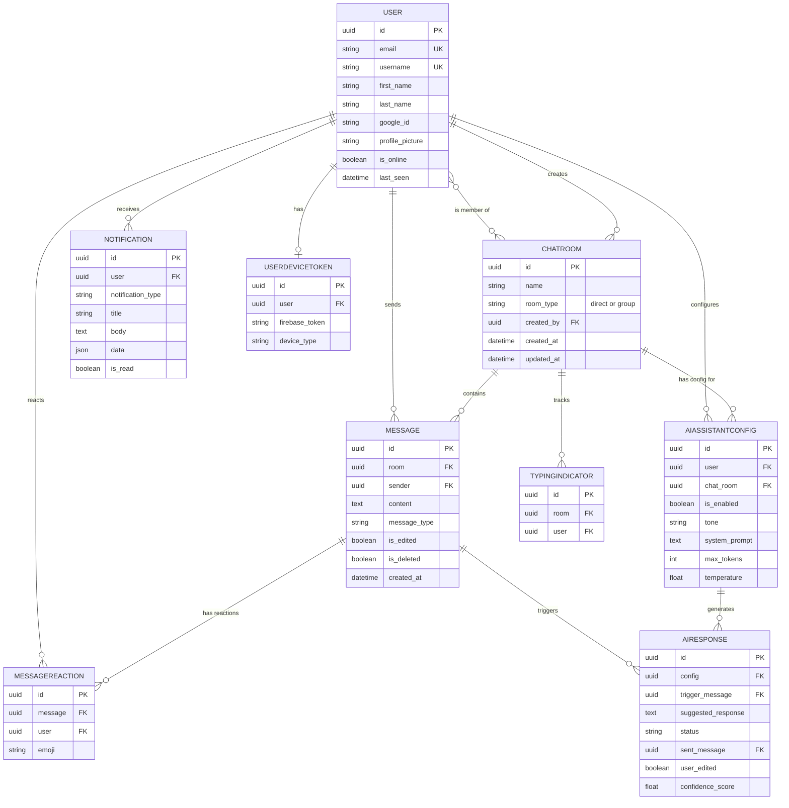

# Entity Relationship Diagram

## Key relationships explained

- A **ChatRoom** is either `direct` (exactly 2 members) or `group` (2+ members), enforced at the API layer, not the database — this keeps the schema flexible for future room types.
- **AIAssistantConfig** is scoped per `(user, chat_room)` pair via a unique constraint — each participant independently controls whether they receive AI suggestions in that specific conversation.
- **AIResponse** links back to the `Message` that triggered it (`trigger_message`) and, once accepted, to the `Message` that was actually sent (`sent_message`) — this preserves a full audit trail of what the AI suggested versus what was ultimately sent.
- **Message** uses soft deletion (`is_deleted` flag) rather than hard deletion, so conversation history and reaction/AI-response references stay intact.
